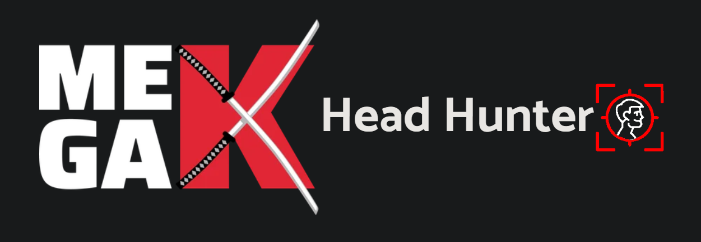

<h1>MegaK Head Hunter - frontend v1 </h1>

Previews and builds on Vercel: https://head-hunter-frontend.vercel.app

---

Project Head Hunter is a final bonus stage of 1 year Full Stack JS Bootcamp.
The application brings together all knowledge and technologies which we were learning throughout this time.
Application is created to connect software developer students with recruiters through admin supervision. Main functionalities of the app:

-  mass load number of students from csv file
-  mass load number of recruiter from csv file
-  displaying all user, student, recruiters and managing them from admin account
-  email account activation (security)
-  reset password functionality through email token (security)
-  CRON for managing overdue interviews
-  student access to complete and maintain up-to-date detailed Portfolio/CV
-  protected role guards on backend (security)
-  protected routes by roles on front-end (security)
-  recruiter can see all active and available students
-  recruiter can add student to own interview list
-  recruiter can manage status on interview list
-  recruiter can filter students by names and all fields from special filter component

### Project DEMO week 4:

## Tech Stack:

### - JavaScript 

### - ReactJS 

### - TypeScript 

### - Redux Toolkit 

### Styled Components 

---

### Additional packages:

Dep:

-  styled-components
-  react-star-rating
-  chakra-ui
-  axios
-  emotion
-  mui
-  file-saver
-  react-hook-form
-  react-icons
-  react-redux
-  react-toastify
-  typescript

Dev:

-  customize-cra
-  react-app-rewire-alias
-  react-app-rewired
-  prettier
-  lint-staged
-  husky

 

---

In the project directory, you can run:

### `npm start`

Runs the app in the development mode.\
Open [http://localhost:3000](http://localhost:3000) to view it in the browser.

The page will reload if you make edits.\
You will also see any lint errors in the console.

### `npm run build`

Builds the app for production to the `build` folder.\
It correctly bundles React in production mode and optimizes the build for the best performance.

The build is minified and the filenames include the hashes.\
Your app is ready to be deployed!

See the section about [deployment](https://facebook.github.io/create-react-app/docs/deployment) for more information.
